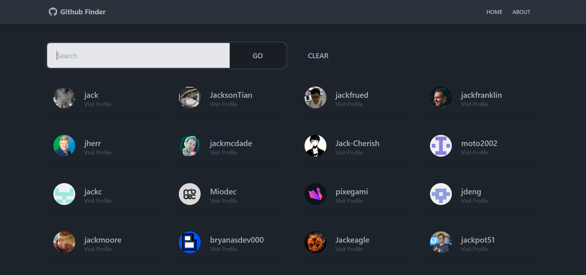

# GitHub Finder App

##

Welcome to the GitHub Profile Viewer Website! This platform allows you to search for GitHub users and view their profiles along with their repositories.

## Features

-   Search for GitHub users by their username
-   View detailed profiles of GitHub users, including their bio, location, followers, following, and more
-   Browse through the repositories of GitHub users
-   Get insights into the number of repositories, followers, and following count of the searched user

## Technologies Used

-   React
-   Context API
-   Tailwind CSS
-   Vite
-   GitHub REST API
-   axios

## Setup

1. Clone this repository to your local machine.
2. Run `npm install` to install the necessary dependencies.
3. Ensure you have your own GitHub Personal Access Token. If you don't have one, you can generate it [here](https://github.com/settings/tokens).
4. Create a `.env` file in the root directory of the project.
5. Add the following environment variables to your `.env` file:
    - `VITE_GITHUB_URL = "https://api.github.com"`
    - `VITE_GITHUB_TOKEN = "<your GitHub token here>"`
6. Save the `.env` file.
7. Run `npm run dev` to start the development server.

## Demo

Check out our live demo [here](https://appgithubffinder.vercel.app/) to see the website in action!
